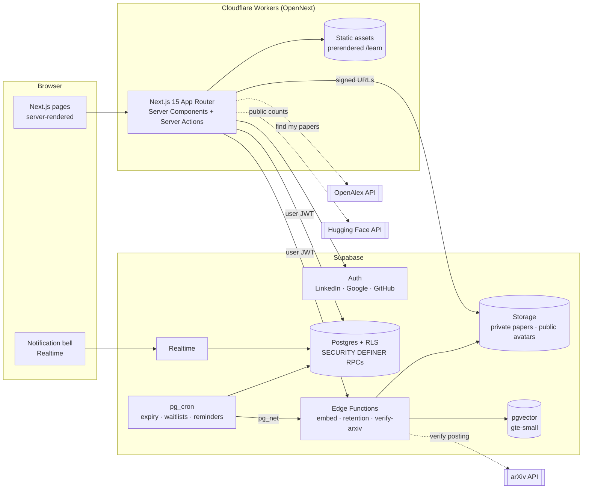

# Endorse Commons

**Anyone with a real contribution should be able to share it with the world.**

Endorse Commons is a free, open-source community that helps first-time researchers (students, young learners and independent researchers anywhere) learn how open science works, get honest feedback from people who have published, and find someone willing to vouch for their work.

> Endorse Commons is an independent project. It is **not affiliated with arXiv**. Thank you to arXiv for use of its open access interoperability. This service was not reviewed or approved by, nor does it necessarily express or reflect the policies or opinions of, arXiv.

## Goals

1. **Free knowledge.** Every question you have before your first paper is answered for free, with no sign-in.
2. **Fair access.** Getting feedback and an endorsement depends on your work, not on your network, institution or country.
3. **Visible generosity.** The unpaid work of helping newcomers is recognized and portable.
4. **Protect the commons.** Keep quality high so open preprint servers stay open for everyone. No endorsement mills.

North-star metric: first-time authors whose paper is posted after receiving feedback here. Supporting metric: pay-it-forward pledges fulfilled.

## What it does

- **Authors** pass a 7-question arXiv readiness check, then post an **abstract**. It is visible only to signed-in members and never indexed.
- **Endorsers** (arXiv authors who self-attest eligibility per category, with an evidence link) opt in by accepting abstracts from a matched feed.
- The author uploads the **full paper** (a private PDF) and shares it with the reviewers they choose. At most 3 reviewers hold a paper at once, and extra acceptances wait in a fair FIFO **waitlist**.
- Reviewers and authors exchange **feedback rounds** in in-app threads. There are no private DMs, and every message can be reported.
- A reviewer who has **opened the full paper on the platform** and **checked the author's LinkedIn** can endorse on arXiv's own form, then record it here. The author confirms. Every other review on that paper closes, and those reviewers are notified in-app.
- The author adds the **arXiv ID** once the paper is announced. The platform checks it against the arXiv API, which builds the endorser's public **track record**.
- **Karma** rewards helpers. Endorsing and declining earn the same points.
- **Pay-it-forward pledges**: newly endorsed authors can pledge to review later, and are reminded 3 months after their paper is posted.
- A **learning center** that is free, sign-in-free and SEO-first: 18 articles drafted from official arXiv documentation, plus a public readiness check.
- Optional **public availability pages** for endorsers, with OG images and share buttons.

There is no email of any kind and no payments. AI screening is a future add-on behind the `ai_screening_enabled` flag.

_Screenshots: coming soon._

## Architecture



**Where the rules live.** Every state transition (accept, share, waitlist, feedback, endorse, decline, confirm, and so on) is a `SECURITY DEFINER` SQL function in `supabase/migrations`. Clients can only read, through RLS, and call those RPCs. Direct table writes are revoked. The Next.js layer is thin: it validates input shape, calls the RPC as the signed-in user, and renders.

| Path | What |
|---|---|
| `supabase/migrations/` | Schema, reference data (categories and topics), RPCs and triggers, RLS and views, storage policies, cron jobs |
| `supabase/tests/` | pgTAP tests: state machine, waitlist, fan-out, karma, RLS, trust features, cron (140 assertions) |
| `supabase/functions/` | Edge Functions: `embed` (gte-small embeddings), `retention` (PDF deletion) and `verify-arxiv` (arXiv lookup) |
| `src/app/(public)/` | Home, learning center, readiness check, karma, availability pages, legal pages |
| `src/app/app/` | The signed-in app: onboarding, feed, papers, reviews, notifications, settings, admin |
| `content/learn/` | Learning-center articles (Markdown and frontmatter, CC BY 4.0) |
| `scripts/build-learn.mjs` | Compiles articles to static JSON at build time, with no Markdown runtime in the Worker |
| `tests/unit`, `tests/e2e` | Vitest unit tests and Playwright flows |

## Self-hosting in 10 minutes

You need Node 22, Docker, the [Supabase CLI](https://supabase.com/docs/guides/cli), and a Cloudflare account for deployment.

### 1. Run it locally

```bash
git clone https://github.com/maximem-ai/preprint_commons && cd preprint_commons
npm install
supabase start                      # applies all migrations, starts Auth/Storage/Realtime/Edge
supabase status                     # copy API URL, anon key, service_role key
cp .env.example .env.local          # fill in the three values above
npm run dev                         # http://localhost:3000
```

OAuth providers need real credentials even locally. Put them in your shell env as `SUPABASE_AUTH_{LINKEDIN,GOOGLE,GITHUB}_{CLIENT_ID,SECRET}` before `supabase start`. The local stack also enables email/password **only** so the end-to-end tests can create sessions.

### 2. Deploy (no secrets to copy between dashboards)

The hosted app needs **no server secret**: arXiv verification runs in a Supabase Edge Function, and pg_cron authenticates to Edge Functions with a token generated inside the database. The only values the app needs are public (Supabase URL, anon key, site URL).

**Supabase** — either ask Claude with the Supabase connector enabled ("apply the migrations and deploy the Edge Functions to project X"), or with the CLI:

```bash
supabase link --project-ref <project-ref>
supabase db push                 # schema, RLS, functions, cron jobs, storage buckets, cron token
supabase functions deploy        # embed, retention, verify-arxiv (JWT settings come from config.toml)
```

Then run once in the SQL editor so cron can reach the Edge Functions, and enable the **pg_net** extension if it isn't already on:

```sql
select vault.create_secret('https://<project-ref>.supabase.co', 'project_url');
```

To apply future migrations automatically on every push to `main`, connect the repo under **Project Settings → Integrations → GitHub** (Supabase directory: `supabase`, production branch: `main`).

**Cloudflare Workers** — connect the GitHub repo once; every push to `main` then builds and deploys:

1. Workers & Pages → **Create** → **Import a repository** → authorize the Cloudflare GitHub app → pick this repo.
2. Project name **`preprint-commons`** (must match `name` in `wrangler.jsonc`), production branch `main`.
3. Build command `npx opennextjs-cloudflare build`, deploy command `npx opennextjs-cloudflare deploy`.
4. Build variables: `NEXT_PUBLIC_SUPABASE_URL`, `NEXT_PUBLIC_SUPABASE_ANON_KEY`, `NEXT_PUBLIC_SITE_URL` (they're inlined at build time).
5. Optional: Worker → Settings → Domains & Routes → add your custom domain, then update `NEXT_PUBLIC_SITE_URL` and redeploy.

Manual alternative: `npx wrangler login`, then `NEXT_PUBLIC_SUPABASE_URL=… NEXT_PUBLIC_SUPABASE_ANON_KEY=… NEXT_PUBLIC_SITE_URL=… npm run deploy`. `npm run preview` runs the Worker locally (values in `.dev.vars`).

**Bundle size:** about 2.3 MiB gzipped, under the Workers Free plan's 3 MiB cap (Paid, $5/month, allows 10 MiB).

### 3. Enable sign-in providers (Supabase dashboard → Authentication)

Under **URL Configuration** set the **Site URL** to your production URL and add `https://<your-domain>/auth/callback` to **Redirect URLs**. Under **Providers**, paste each provider's Client ID and secret; the callback URL to register with every provider is `https://<project-ref>.supabase.co/auth/v1/callback`.

- **GitHub** (≈2 min): GitHub → Settings → Developer settings → OAuth Apps → New. The GitHub username is stored on the profile automatically.
- **Google** (≈10 min): Google Cloud Console → APIs & Services → OAuth consent screen (External; skip the logo at first to avoid branding review), then Credentials → OAuth client ID (Web application).
- **LinkedIn (OIDC)** (≈10 min): [LinkedIn developer portal](https://www.linkedin.com/developers/apps) → Create app (must be linked to a LinkedIn Company Page) → Products → *Sign In with LinkedIn using OpenID Connect*.
- **Email**: turn it **off**. The product sends no email and has no magic links.

The login page shows only the providers you've enabled, so you can launch with just one (for example GitHub) and enable others later without a code change or redeploy. Hugging Face: users add their username on their profile (see `DECISIONS.md`).

**Make yourself a moderator** after signing in once: `update profiles set role = 'moderator' where handle = '<your-handle>';`

### 4. Continuous integration

`.github/workflows/ci.yml` runs on pull requests: lint, typecheck, unit tests, build, pgTAP against a local Supabase, and Playwright. It uses `supabase/setup-cli`; if your organization restricts third-party actions, allow it under **Organization settings → Actions → General**. Deployment doesn't depend on GitHub Actions.

### When to move Supabase from Free to Pro

Free is fine for building and a soft launch. Move to **Pro** when:

- **Real users are signing up.** Free projects pause after a week of inactivity, and there are **no backups**. Pro adds daily backups (and optional point-in-time recovery).
- Storage nears **1 GB**. The 10 MB PDF limit and 30-day retention keep usage low, but active papers add up.
- You need more than about 50k monthly active users, or larger Realtime and Edge Function quotas.

## Environment variables

| Name | Where | Notes |
|---|---|---|
| `NEXT_PUBLIC_SUPABASE_URL` | build + runtime | Supabase API URL |
| `NEXT_PUBLIC_SUPABASE_ANON_KEY` | build + runtime | Public anon key (RLS applies) |
| `NEXT_PUBLIC_SITE_URL` | build | Canonical URLs, sitemap, OAuth redirect |
| `APP_NAME` | runtime | Defaults to "Endorse Commons" (set in `wrangler.jsonc`) |

## Testing

```bash
npm run lint && npm run typecheck
npm test                 # Vitest: validators, arXiv parsing and name matching, readiness, content, share copy
supabase test db         # pgTAP against the local Supabase (or: npm run test:db on a plain Postgres 16)
npm run test:e2e         # Playwright: author path, reviewer path, acceptance scenario, learning center
```

`npm run test:db` runs the migrations and pgTAP suite on a throwaway Postgres 16 with a small Supabase shim, for machines without Docker.

## Contributing

See [CONTRIBUTING.md](CONTRIBUTING.md) (DCO sign-off, proposing learn articles, adding topics), [CODE_OF_CONDUCT.md](CODE_OF_CONDUCT.md), [GOVERNANCE.md](GOVERNANCE.md) and [SECURITY.md](SECURITY.md). Design decisions are recorded in [DECISIONS.md](DECISIONS.md).

## License

- Code: [AGPL-3.0](LICENSE)
- Learning-center articles (`content/learn/**`): [CC BY 4.0](content/learn/LICENSE)

Built and maintained by the team at [Maximem](https://maximem.ai).
