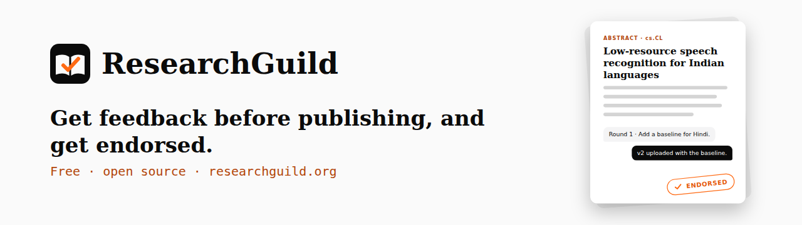
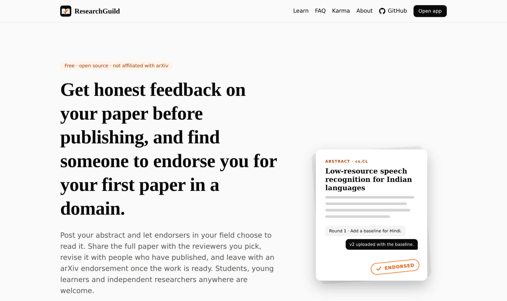
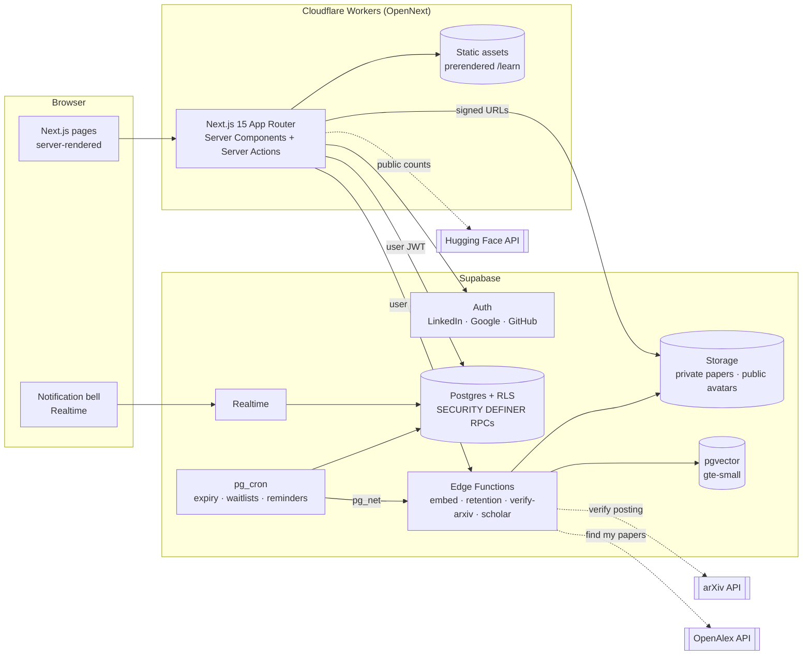

<p align="center">
  <picture>
    <source media="(prefers-color-scheme: dark)" srcset=".github/banner-dark.png">
    
  </picture>
</p>

<h3 align="center">Get honest feedback on your paper before publishing, and find someone to endorse you for your first paper in a domain.</h3>

<p align="center">
  <a href="https://researchguild.org">Website</a> ·
  <a href="https://researchguild.org/learn">Learning center</a> ·
  <a href="https://researchguild.org/#faq">FAQ</a> ·
  <a href="#self-host-in-10-minutes">Self-host</a> ·
  <a href="CONTRIBUTING.md">Contribute</a>
</p>

<p align="center">
  <a href="https://github.com/maximem-ai/research-guild/actions/workflows/ci.yml"></a>
  <a href="LICENSE"></a>
  <a href="content/learn/LICENSE"></a>
  <a href="https://researchguild.org"></a>
  <a href="CONTRIBUTING.md"></a>
</p>

arXiv asks first-time authors to find an endorser, and most first-time researchers do not know one. ResearchGuild lets you post your abstract, revise your paper with people who have published, and leave with an arXiv endorsement once the work is ready.

Most endorsement requests are cold emails to strangers. On ResearchGuild, endorsers in your field opt in, read the full paper, and give feedback before they decide.

<p align="center">
  <picture>
    <source media="(prefers-color-scheme: dark)" srcset=".github/screenshot-home-dark.png">
    
  </picture>
</p>

> ResearchGuild is an independent project and is **not affiliated with arXiv**. Thank you to arXiv for use of its open access interoperability. This service was not reviewed or approved by, nor does it necessarily express or reflect the policies or opinions of, arXiv.

## Writing your first paper?

1. **Learn how arXiv works.** Read the free [learning center](https://researchguild.org/learn) (18 articles, no sign-in) and take the 7-question [readiness check](https://researchguild.org/learn/readiness-check).
2. **Post your abstract.** Only the abstract goes out, and only to signed-in members; search engines never index it. Endorsers in your arXiv category choose to accept it.
3. **Share the full paper.** Send the private PDF to the reviewers you pick. Three can hold it at once, and anyone else waits on a fair first-come waitlist.
4. **Revise with feedback.** Work through feedback rounds in threads on the platform and upload new versions as the draft improves.
5. **Get endorsed.** A reviewer who has read the full paper can endorse you on arXiv's own form. You add your arXiv ID once the paper is announced, and the platform checks it against the arXiv API.

## Already able to endorse on arXiv?

1. **Claim your categories.** Add each arXiv category you can endorse in, with your arXiv "show endorsers" link as evidence.
2. **Choose what to read.** Browse abstracts matched to your categories and topics, and accept only the ones you want to review.
3. **Review at your own pace.** Set how many papers you hold at once (1 to 10) and pause whenever you need to.
4. **Endorse or decline.** Both earn the same karma. Endorsements that lead to a posted paper build your public track record, and an optional availability page helps authors find you.

## How it works: read-first endorsement

ResearchGuild is built around one rule: nobody vouches for a paper they have not read. Every part of it is enforced in Postgres, not in the UI.

| Part | What the database enforces |
|---|---|
| Opt-in matching | Only endorsers with a capability in the paper's primary category can accept its abstract. |
| Capped sharing | At most 3 reviewers hold a paper at once; extra acceptances wait in a first-in, first-out waitlist that promotes automatically. |
| Read before you vouch | Recording an endorsement requires that the reviewer opened the full paper on the platform and checked the author's LinkedIn profile. |
| Neutral incentives | Endorsing and declining earn the same karma, a decline needs a written reason, karma between co-authors is withheld, and mutual endorsements are flagged for moderators. |
| Verified outcome | The arXiv ID is checked against the arXiv API before it counts toward the endorser's public track record. |

These rules are covered by 148 pgTAP assertions in [`supabase/tests/`](supabase/tests). Re-run them on any machine with `npm run test:db` (plain Postgres 16, no Docker) or `supabase test db`.

## FAQ

<!-- faq:start (generated from src/lib/faq.ts by `npm run readme:faq`; do not edit by hand) -->
**Finding an endorser**

<details><summary>How do I find an endorser here?</summary>

Sign in, pass the 7-question readiness check and post your abstract. Endorsers who listed your arXiv category see it in their feed, and the ones who want to review it accept it. You then share your full paper with them, revise it through feedback rounds, and one of them may endorse you on arXiv's own form when the work is ready.

</details>
<details><summary>Who can see my abstract and my paper?</summary>

Only signed-in members can read your abstract, and search engines never index it. Your full paper is a private PDF that you share with reviewers you choose, at most 3 at a time, and the file is deleted 30 days after your paper closes.

</details>
<details><summary>What if nobody accepts my abstract?</summary>

Your abstract stays open while you keep improving it. You can nudge endorsers who publish an availability page (up to 3 nudges per paper each week), and the learning center explains other routes to an endorser, such as co-authors and advisors.

</details>
<details><summary>Is an endorsement guaranteed?</summary>

No. Endorsers decide on the merits of your full paper, and a decline earns them exactly the same karma as an endorsement, so nobody is rewarded for saying yes. A decline always comes with a reason you can act on.

</details>
<details><summary>What does it cost?</summary>

Nothing. ResearchGuild is free and open source under AGPL-3.0; it sends no email and shows no ads.

</details>
<details><summary>Is ResearchGuild part of arXiv?</summary>

No. ResearchGuild is independent and not affiliated with arXiv. Endorsements happen on arXiv's own form using your endorsement code, and we never touch arXiv accounts.

</details>

**Becoming an endorser**

<details><summary>Who can become an endorser?</summary>

Anyone arXiv already lets endorse in a category. arXiv bases that on papers you authored in the subject area, submitted between three months and five years ago, and on being registered as an author of those papers. ResearchGuild cannot grant eligibility; it helps eligible people find authors who need them.

</details>
<details><summary>How do I add myself as an endorser?</summary>

Open Settings, choose a category and paste the arXiv "show endorsers" link for one of your papers as evidence (https://arxiv.org/auth/show-endorsers/ followed by the paper ID). Your capability shows as claimed until a paper you endorse here is verified as posted in that category, and then it becomes confirmed.

</details>
<details><summary>How much time does it take?</summary>

You set the pace. Choose how many papers you review at once (1 to 10), pause whenever you need to, and accept only the abstracts you want to read. Reviews that go quiet expire, so authors are never left waiting on you indefinitely.

</details>
<details><summary>Do I have to endorse every paper I review?</summary>

No. Read the full paper and give feedback, then endorse on arXiv's form if the work is ready or decline with a reason; both earn the same karma. Before you can record an endorsement you must have opened the full paper here and checked the author's LinkedIn profile.

</details>
<details><summary>What do I get for helping?</summary>

Karma on per-category leaderboards, badges, and a public track record of the papers you endorsed that went on to be posted on arXiv. You can also publish an availability page with share buttons so that authors in your field can find you.

</details>
<details><summary>Will my name be public?</summary>

Only if you turn on your availability page. Otherwise your profile is visible to signed-in members only, and leaderboards show you as "A community member".

</details>

<!-- faq:end -->

## What is open, what is hosted

| | Open source (this repo) | [researchguild.org](https://researchguild.org) |
|---|---|---|
| Code | All of it, under AGPL-3.0 | The same code, deployed from `main` |
| Learning center | 18 articles and a glossary under CC BY 4.0 in `content/learn/` | Published at `/learn`, no sign-in |
| Data | Your own Supabase project | Hosted by Maximem on Supabase and Cloudflare; full papers are deleted 30 days after a paper closes |
| Sign-in | Any OAuth provider Supabase supports | GitHub |
| Cost | Supabase and Cloudflare free tiers are enough to start | Free for everyone, no ads, no email |

## Quickstart

```bash
git clone https://github.com/maximem-ai/research-guild && cd research-guild
npm install
supabase start                 # Postgres, Auth, Storage, Realtime and Edge Functions, with every migration applied
cp .env.example .env.local     # paste the API URL and anon key from `supabase status`
npm run dev                    # http://localhost:3000
```

You need Node 22, Docker and the [Supabase CLI](https://supabase.com/docs/guides/cli). OAuth sign-in needs real provider credentials even locally: export `SUPABASE_AUTH_GITHUB_CLIENT_ID` and `SUPABASE_AUTH_GITHUB_SECRET` (and the Google or LinkedIn equivalents) before `supabase start`. The local stack also enables email and password sign-in, only so the end-to-end tests can create sessions.

**Using a coding agent?** Paste this into Claude Code, Codex or Cursor:

> Set up ResearchGuild for local development: clone https://github.com/maximem-ai/research-guild, run `npm install`, start Supabase with `supabase start`, copy `.env.example` to `.env.local` and fill in the API URL and anon key from `supabase status`, then run `npm run lint && npm run typecheck && npm test && npm run test:db`. Read `AGENTS.md` before changing anything.

## Architecture



**Where the rules live.** Every state transition (accept, share, waitlist, feedback, endorse, decline, confirm, and so on) is a `SECURITY DEFINER` SQL function in `supabase/migrations`. Clients can only read, through RLS, and call those RPCs. Direct table writes are revoked. The Next.js layer is thin: it validates input shape, calls the RPC as the signed-in user, and renders.

| Path | What |
|---|---|
| `supabase/migrations/` | Schema, reference data (categories and topics), RPCs and triggers, RLS and views, storage policies, cron jobs |
| `supabase/tests/` | pgTAP tests: state machine, waitlist, fan-out, karma, RLS, trust features, cron (148 assertions) |
| `supabase/functions/` | Edge Functions: `embed` (gte-small embeddings), `retention` (PDF deletion), `verify-arxiv` (arXiv lookup) and `scholar` (past-paper lookups via OpenAlex and arXiv) |
| `src/app/(public)/` | Home, learning center, readiness check, karma, availability pages, legal pages |
| `src/app/app/` | The signed-in app: onboarding, feed, papers, reviews, notifications, settings, admin |
| `content/learn/` | Learning-center articles (Markdown and frontmatter, CC BY 4.0) |
| `scripts/build-learn.mjs` | Compiles articles to static JSON at build time, with no Markdown runtime in the Worker |
| `tests/unit`, `tests/e2e` | Vitest unit tests and Playwright flows |

## Self-host in 10 minutes

Run the [Quickstart](#quickstart) first, then deploy.

### 1. Deploy (no secrets to copy between dashboards)

The hosted app needs **no server secret**: arXiv verification runs in a Supabase Edge Function, and pg_cron authenticates to Edge Functions with a token generated inside the database. The only values the app needs are public (Supabase URL, anon key, site URL).

**Supabase.** Either ask Claude with the Supabase connector enabled ("apply the migrations and deploy the Edge Functions to project X"), or with the CLI:

```bash
supabase link --project-ref <project-ref>
supabase db push                 # schema, RLS, functions, cron jobs, storage buckets, cron token
supabase functions deploy        # embed, retention, verify-arxiv, scholar (JWT settings come from config.toml)
```

Then run once in the SQL editor so cron can reach the Edge Functions, and enable the **pg_net** extension if it is not already on:

```sql
select vault.create_secret('https://<project-ref>.supabase.co', 'project_url');
```

To apply future migrations automatically on every push to `main`, connect the repo under **Project Settings → Integrations → GitHub** (Supabase directory: `supabase`, production branch: `main`).

**Cloudflare Workers.** Connect the GitHub repo once; every push to `main` then builds and deploys:

1. Workers & Pages → **Create** → **Import a repository** → authorize the Cloudflare GitHub app → pick this repo.
2. Project name matching `name` in `wrangler.jsonc` (`preprint-commons` for researchguild.org), production branch `main`.
3. Build command `npx opennextjs-cloudflare build`, deploy command `npx opennextjs-cloudflare deploy`.
4. Build variables: `NEXT_PUBLIC_SUPABASE_URL`, `NEXT_PUBLIC_SUPABASE_ANON_KEY`, `NEXT_PUBLIC_SITE_URL` (they are inlined at build time).
5. Optional: Worker → Settings → Domains & Routes → add your custom domain, then update `NEXT_PUBLIC_SITE_URL` and redeploy.

Manual alternative: `npx wrangler login`, then `NEXT_PUBLIC_SUPABASE_URL=… NEXT_PUBLIC_SUPABASE_ANON_KEY=… NEXT_PUBLIC_SITE_URL=… npm run deploy`. `npm run preview` runs the Worker locally (values in `.dev.vars`).

**Bundle size:** about 2.3 MiB gzipped, under the Workers Free plan's 3 MiB cap (Paid, $5/month, allows 10 MiB).

### 2. Enable sign-in providers (Supabase dashboard → Authentication)

Under **URL Configuration** set the **Site URL** to your production URL and add `https://<your-domain>/auth/callback` to **Redirect URLs**. Under **Providers**, paste each provider's Client ID and secret; the callback URL to register with every provider is `https://<project-ref>.supabase.co/auth/v1/callback`.

- **GitHub** (≈2 min): GitHub → Settings → Developer settings → OAuth Apps → New. The GitHub username is stored on the profile automatically.
- **Google** (≈10 min): Google Cloud Console → APIs & Services → OAuth consent screen (External; skip the logo at first to avoid branding review), then Credentials → OAuth client ID (Web application).
- **LinkedIn (OIDC)** (≈10 min): [LinkedIn developer portal](https://www.linkedin.com/developers/apps) → Create app (must be linked to a LinkedIn Company Page) → Products → *Sign In with LinkedIn using OpenID Connect*.
- **Email**: turn it **off**. The product sends no email and has no magic links.

The login page shows only the providers you have enabled, so you can launch with just one (for example GitHub) and enable others later without a code change or redeploy. Hugging Face: users add their username on their profile (see `DECISIONS.md`).

**Make yourself a moderator** after signing in once: `update profiles set role = 'moderator' where handle = '<your-handle>';`

### 3. Continuous integration

`.github/workflows/ci.yml` runs on every pull request and on pushes to `main`: DCO sign-off, lint, typecheck, unit tests, build, pgTAP against a local Supabase, and Playwright. It uses GitHub-owned actions only, so it also runs where an organization blocks third-party actions. Deployment does not depend on GitHub Actions.

### When to move Supabase from Free to Pro

Free is fine for building and a soft launch. Move to **Pro** when:

- **Real users are signing up.** Free projects pause after a week of inactivity, and there are **no backups**. Pro adds daily backups (and optional point-in-time recovery).
- Storage nears **1 GB**. The 10 MB PDF limit and 30-day retention keep usage low, but active papers add up.
- You need more than about 50k monthly active users, or larger Realtime and Edge Function quotas.

## Environment variables

| Name | Where | Notes |
|---|---|---|
| `NEXT_PUBLIC_SUPABASE_URL` | build + runtime | Supabase API URL |
| `NEXT_PUBLIC_SUPABASE_ANON_KEY` | build + runtime | Public anon key (RLS applies) |
| `NEXT_PUBLIC_SITE_URL` | build | Canonical URLs, sitemap, OAuth redirect |
| `APP_NAME` | runtime | Defaults to "ResearchGuild" (set in `wrangler.jsonc`) |

## Testing

```bash
npm run lint && npm run typecheck
npm test                 # Vitest: validators, arXiv parsing and name matching, readiness, content, share copy
supabase test db         # pgTAP against the local Supabase (or: npm run test:db on a plain Postgres 16)
npm run test:e2e         # Playwright: author path, reviewer path, acceptance scenario, learning center
```

`npm run test:db` runs the migrations and pgTAP suite on a throwaway Postgres 16 with a small Supabase shim, for machines without Docker.

## Contributing

Issues use forms for bugs, feature requests and learning-center corrections. Pull requests run DCO, lint, typecheck, unit, SQL and end-to-end checks, and a maintainer from [`.github/CODEOWNERS`](.github/CODEOWNERS) reviews them. Start with [CONTRIBUTING.md](CONTRIBUTING.md), and see [AGENTS.md](AGENTS.md), [CODE_OF_CONDUCT.md](CODE_OF_CONDUCT.md), [GOVERNANCE.md](GOVERNANCE.md) and [SECURITY.md](SECURITY.md). Design decisions are recorded in [DECISIONS.md](DECISIONS.md).

## Goals

1. **Learn for free.** Every question you have before your first paper is answered openly, with no sign-in.
2. **Get judged on your work.** Feedback and endorsement depend on the paper, not on your network, institution or country.
3. **Get credit for helping.** Reviewing newcomers is unpaid work, so it shows up as karma, badges and a portable track record.
4. **Keep arXiv open.** Endorsers read the full paper before vouching for it, which keeps endorsement mills out.

North-star metric: first-time authors whose paper is posted after receiving feedback here. Supporting metric: pay-it-forward pledges fulfilled.

## License

- Code: [AGPL-3.0](LICENSE)
- Learning-center articles (`content/learn/**`): [CC BY 4.0](content/learn/LICENSE)

Built and maintained by the team at [Maximem](https://maximem.ai).
